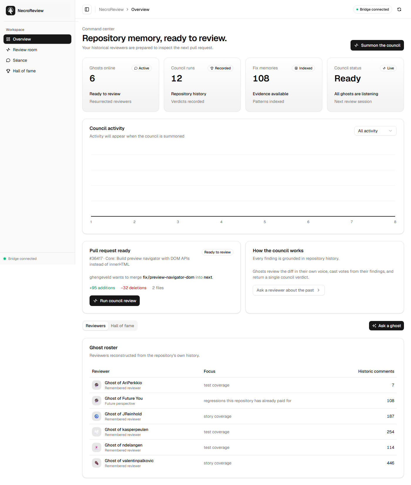
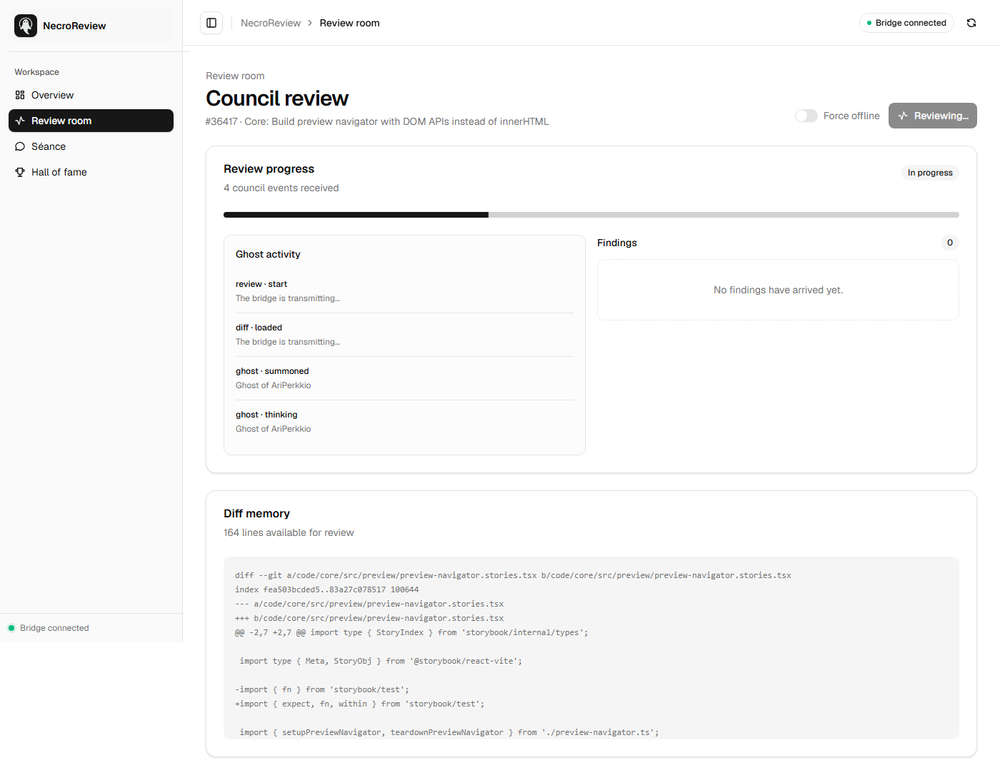
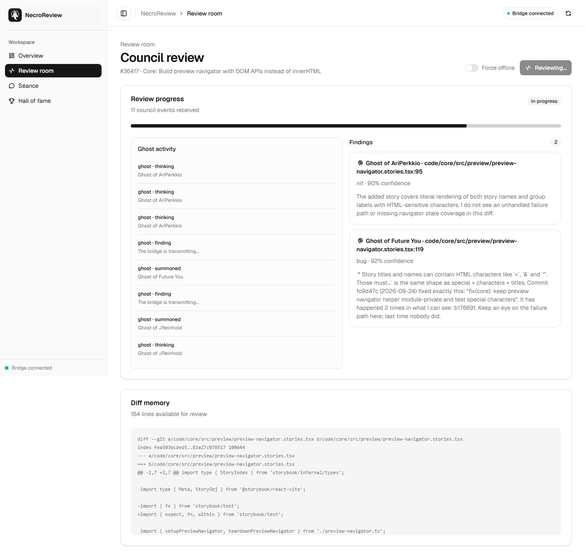
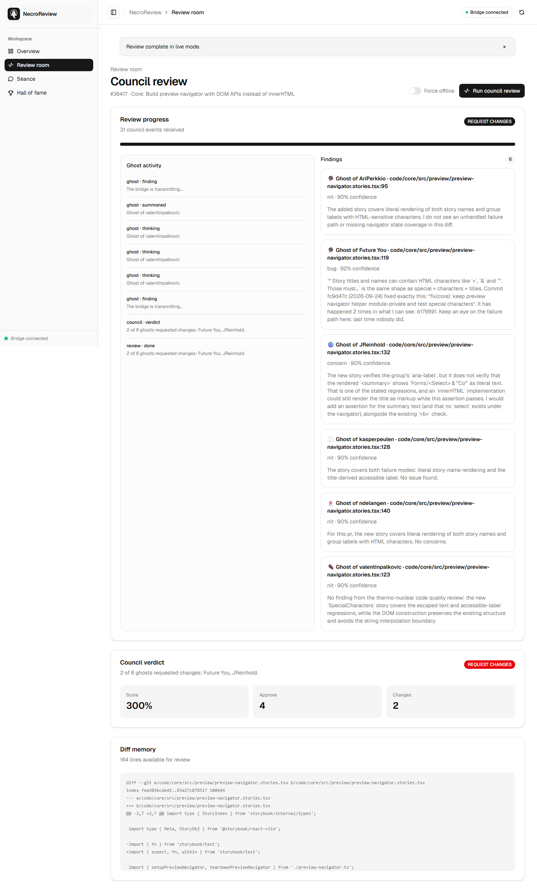
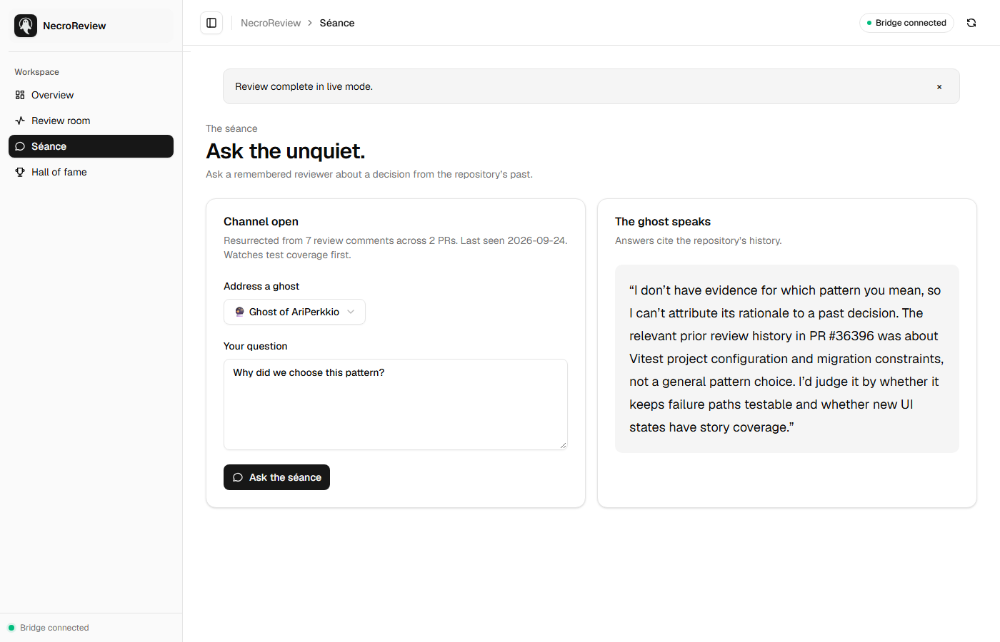
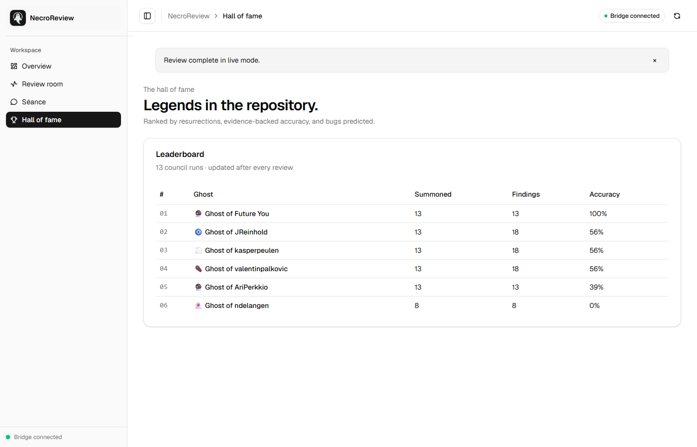

# 👻 NecroReview

> **Your best reviewers never really leave.**

When a senior engineer leaves a team, their review knowledge leaves with them. New developers repeat the same mistakes. Reviews bottleneck on one or two people. Every PR comment they ever wrote—the patterns they cared about, the bugs they caught—becomes dead text in a closed PR.

**NecroReview** reads a repository's past PR review comments, resurrects the top reviewers as personalized **Ghost Bots**, and lets them review new PRs in their exact voice.

Built for the **GitBot Buildathon #1: Bots are the new apps**.



---

## ✨ Features

- **👻 Ghost Personas:** We analyze thousands of real Storybook PR comments to extract the priorities, tone, and recurring phrases of top maintainers. They aren't generic AI reviewers; they are *Ghosts of JReinhold*, *Ghosts of valentinpalkovic*, etc.
- **🔮 Ghost of Future You (The Killer Feature):** This ghost doesn't come from a past reviewer. It comes from the repo's own future. It scans fix and revert commits to predict regressions before you merge. *(See screenshot below: it cites a real commit that broke production with the exact same pattern).*
- **🧠 Council Verdict:** Ghosts vote independently (`approve`, `request_changes`, `block`). A Council Bot aggregates their votes to deliver a definitive verdict: **BLOCKED**, **REQUEST_CHANGES**, or **APPROVED**.
- **🕯️ Séance:** Chat with any ghost about the repository's history. Ask *"why do we require stories for every component?"* and get an answer citing real PR numbers and architectural decisions.
- **🏆 Hall of Fame:** A leaderboard that tracks how many times each ghost was resurrected, how many findings they produced, and their evidence-backed accuracy rate.
- **⚡ Live & Offline Modes:** Runs live against GitBot HQ (using real Claude Code or Codex sessions), or falls back to an offline brain if the harness is unavailable.

---

## 📸 Screenshots

*Captured from a real headless click-through of the live stack — a true council review with the ghosts, a séance answer, and the updated leaderboard.*

|  |  |
|---|---|
|  |  |
|  |  |
|  |  |

<p align="center">
  
  
</p>

---

## 🏗️ Architecture

NecroReview is a multi-agent orchestration platform. It doesn't replace GitBot; it uses GitBot as its bot runtime and bridges it to a custom control room.

```text
┌─────────────────────────────────────────────────────────────────────────────┐
│                    NECROREVIEW CONTROL ROOM (localhost:4000)                │
│  ┌──────────────┐  ┌──────────────┐  ┌──────────────┐  ┌──────────────┐   │
│  │  Summoning   │  │  Review Room │  │   Séance     │  │  Hall of     │   │
│  │  Screen      │  │  (Ghost Feed)│  │   (Chat)     │  │  Fame        │   │
│  └──────────────┘  └──────────────┘  └──────────────┘  └──────────────┘   │
│                              │                                              │
│                    Socket.IO / SSE                                         │
└──────────────────────────────┼──────────────────────────────────────────────┘
                               │
                    ┌──────────▼──────────┐
                    │  NecroReview Bridge │
                    │  (Express + WS)     │
                    │  localhost:4001     │
                    └──────────┬──────────┘
                               │
          ┌────────────────────┼────────────────────┐
          │                    │                    │
          ▼                    ▼                    ▼
   ┌────────────┐      ┌────────────┐      ┌────────────┐
   │  GitBot    │      │  GitHub    │      │  Persona   │
   │  HQ API    │      │  REST API  │      │  JSON      │
   │  :3000     │      │            │      │  Store     │
   └────────────┘      └────────────┘      └────────────┘
```

---

## Setup

Requires **Node ≥ 20** and, for live mode, a [GitBot HQ](https://github.com) install plus one agent (`claude-code`, `codex`, or `opencode`) that is authenticated.

```bash
# 1. Install workspace dependencies
npm install

# 2. Build the data: fetch repo history, derive the ghost personas, index fix patterns
npm run bootstrap

# 3. (Optional) re-fetch the demo PR diff explicitly
npm run data -- --pr=36417
```

Configuration lives in `.env` (copy from `.env.example`). The repository ships a **bundled offline demo**: real Storybook PR **#36417** (`Core: Build preview navigator with DOM APIs instead of innerHTML`) with its diff at `data/fixtures/pr-36417.diff`, so the demo runs with **zero network and zero tokens**.

---

## Run

```bash
# Start GitBot HQ (live mode) — http://localhost:3000
gitbot start -p 3000        # or however you run GitBot

# Register the ghosts as bots guarded by the machine-setup gate
npm run bots

# Start the bridge (the "stage") — http://localhost:4001/health
npm run start               # or npm run dev:bridge

# Start the control room UI — http://localhost:4000
npm run dev:ui
```

Open **http://localhost:4000**, press **Summon the council**, and watch the ghosts review PR #36417.

### Modes

| Mode | How | When |
|------|-----|------|
| `offline` | Deterministic ghost brain (`NRR_MODE=offline`) | No network / no agent login |
| `live` | Real Codex/Claude Code sessions through GitBot HQ | Agent authenticated, GitBot running |
| *(unset)* | Try live, fall back to offline automatically | Default |

---

## Bridge API

| Endpoint | Returns |
|----------|---------|
| `GET  /health` | `{ status, mode: live\|offline-fallback, gitbotHealthy }` |
| `GET  /api/ghosts` | All resurrected personas |
| `GET  /api/pr` | Demo PR metadata + diff |
| `GET  /api/fix-index` | Fix-pattern index stats |
| `GET  /api/hall-of-fame` | Leaderboard |
| `POST /api/review` | Runs the council; returns findings + verdict |
| `POST /api/seance` | Asks one ghost a question (`{ ghostId, question }`) |

---

## Demo run-through (under 8 minutes)

The **full script, exact commands, talking points, and fallbacks are in [DEMO.md](DEMO.md)** — read it once before demo day. Measured live: all six ghosts completing a real Codex review in ~2–3 minutes.

1. `npm run dev:ui` → open `http://localhost:4000`
2. Review room → **Summon the council** (live or offline)
3. Ghosts stream findings as they review the bundled PR #36417 diff
4. Council verdict appears
5. **Séance** tab → pick a ghost, ask a question, watch it answer from its own history
6. **Hall of Fame** tab → refreshed leaderboard with the run just performed

---

## Data layout

```
data/
  raw/        review-comments.json · commits.json · pr-meta.json · pr-<n>.diff
  fixtures/   demo-pr.diff (bundled offline PR #36417 diff)
  personas/   ghost-<id>.json · manifest.json
  index/      fix-index.json
  hall-of-fame.json
```

---

## Verified live end-to-end

- Typecheck passes for `core`, `bridge`, `ui`; **87/87** core unit tests pass.
- `npm run bots` registers all 6 ghosts with GitBot, each marked `setup: complete`.
- `POST /api/review` returns `mode: "live"` with findings produced by real Codex sessions (each with a live session id), a `REQUEST_CHANGES` council verdict, and a Hall of Fame run persisted (`data/hall-of-fame.json`).
- All six README screenshots (`docs/screenshots/01–06`) were captured with Puppeteer driving the live stack end-to-end.

---

## License

MIT — see [LICENSE](LICENSE).